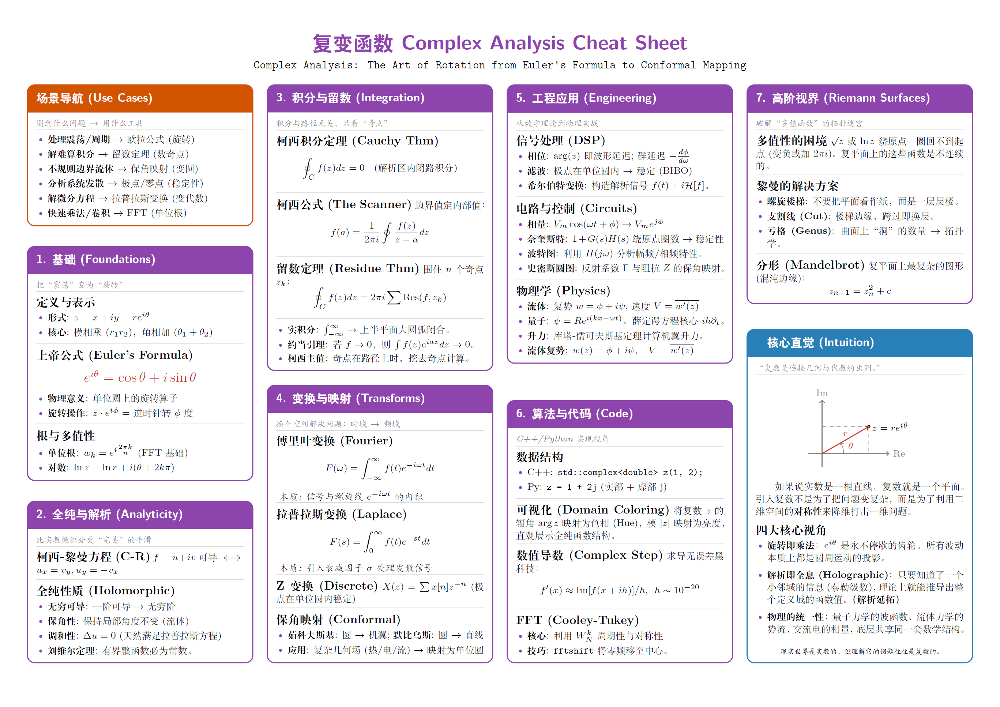

# 📐 工程师数学速查表 (Math Cheat Sheet for Engineers)

> **"手中无剑（不背细节），心中有剑（深知原理）。"**
>
> **"Hand without sword, heart with sword."**

[](https://opensource.org/licenses/MIT)
[](https://www.latex-project.org/)
[](http://makeapullrequest.com)

**Math Cheat Sheet** 是一套专为**资深程序员、算法工程师和架构师**设计的数学速查表（Cheat Sheet）合集。



## 📖 核心哲学 (Philosophy)

数学不是枯燥的计算题，而是你认知世界的**显微镜**与**望远镜**。本项目的目标是从工程的 **"How"** 上升到数学的 **"What"**，帮助你在遇到工程瓶颈时进行\*\*“降维打击”\*\*。

  * **建立索引 (Index)**：拒绝死记硬背，只建立知识索引。
  * **洞察本质 (Intuition)**：透过代码表象，看到背后不变的数学结构（如同构、变换、不变量）。
  * **工程落地 (Engineering)**：每一条公式都应有对应的工程场景（如信号处理、AI 训练、系统架构）。

-----

## ✨ 特性 (Features)

  * **极致排版**：基于 `XeLaTeX` + `multicol` 的 4 栏布局，最大化信息密度。
  * **视觉编码**：
      * 🟢 **绿色系**：基础与描述（线性代数）
      * 🔵 **蓝色系**：信号与变换（复变函数）
      * 🟣 **紫色系**：不确定性（概率统计）
  * **图文并茂**：使用 `TikZ` 手绘核心概念的矢量插图（如复平面、正态分布）。
  * **场景导航**：每个表包含 "Use Cases" 模块，从工程痛点直接映射到数学工具。

-----

## 🛠️ 使用与编译 (Usage)

### 1. 自动编译 (Auto Build)

本项目提供了一键编译脚本 `build.ps1` (Windows PowerShell)，它会自动编译所有子模块，并生成最终的合并版本 `math-cheat-sheet.pdf`。

```powershell
# 在项目根目录下运行
.\build.ps1
```

*   **输出**：编译成功后，根目录下会生成 `math-cheat-sheet.pdf`。
*   **中间文件**：各模块的独立 PDF 文件会生成在 `pdfs/` 目录下（脚本会自动创建该目录）。

### 2. 环境要求 (Requirements)

你需要安装一个支持 XeLaTeX 的 TeX 发行版：

  * **macOS**: [MacTeX](https://www.tug.org/mactex/)
  * **Windows**: [MiKTeX](https://miktex.org/) or [TeX Live](https://www.tug.org/texlive/)
  * **Linux**: TeX Live

### 3. 手动编译 (Manual Compilation)

如果你不使用脚本，也可以手动编译。本项目使用了 `ctex` 宏包以支持中文，**必须使用 `xelatex` 编译器**。

```bash
# Clone the repository
git clone https://github.com/forestye/math-cheat-sheet.git
cd math-cheat-sheet/src

# Compile a specific module (e.g., Linear Algebra)
xelatex -output-directory=../pdfs LinearAlgebra.tex
```

-----

## 📄 License

本项目采用 [MIT License](https://www.google.com/search?q=LICENSE) 开源。你可以免费使用、打印、修改，但请保留原作者信息。

-----

**如果本项目能助你征服数学世界，请给个 Star ⭐ 吧！**

-----
